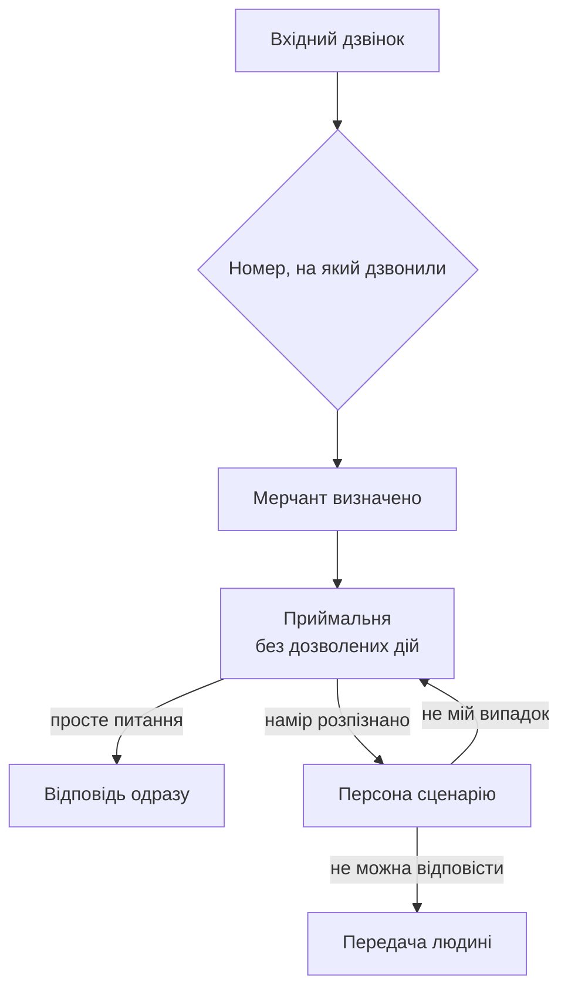

# Голосова платформа для Shopify-мерчантів — схема

Друга частина тестового завдання. Це не проєкт до реалізації, а **схема
з обґрунтуванням**: які варіанти розглядалися, чим пожертвувано і за яких
умов схема перестане працювати.

Наприкінці — розділ «Три речі»: що я вважаю вирішеним, що лишається
відкритим і де бачу найбільший ризик.

---

## Коротко, одним екраном

**Персона — це не окрема програма, а набір налаштувань.** Код один на всіх;
персона задає інструкції, перелік дозволених дій і те, які дані тримати
напоготові.

**Персони варто розділяти за правами, а не за темами.** Пресейл не повинен
мати технічної можливості оформити повернення — не тому, що ми його про це
попросили, а тому, що такої дії в нього немає.

**Вхідні й вихідні дзвінки — це дві різні задачі**, а не одна з двома
режимами. У вхідному ми не знаємо, чого хоче людина. У вихідному знаємо
точно, зате людина дзвінка не чекала.

**Внутрішня платформа — це не адмінка, а інструмент перевірки якості**
для людини, яка не пише код: помітити, що стало гірше → зрозуміти чому →
виправити → переконатися, що стало краще.

**Найбільший ризик — не технічний.** Якщо складні випадки передаються
людині мерчанта, то доступність мерчанта стає частиною нашого продукту.
Кодом це не лікується.

---

## 1. Що таке LiveKit і що ми з нього беремо

LiveKit ставить телефонний дзвінок, людину в браузері й нашу програму
в один тип об'єкта. **Наслідок для бізнесу:** не потрібні дві різні
системи — «телефонна» і «вебова». Одна логіка обслуговує обидва канали,
і те, що перевірили в браузері, працює на телефоні.

### Що беремо готовим

Найважче в голосовій розмові — не логіка, а час. Саме це в LiveKit
вирішено, і саме за це його варто брати:

- **Зрозуміти, що людина договорила.** Не «замовкла на пів секунди»,
  а завершила думку. Людина робить паузи всередині фрази, і агент, який
  влізає в паузу, сприймається як зламаний. Під це в LiveKit є окремо
  навчена модель — єдина власна модель у їхньому стеку, все інше стороннє.
- **Перебивання.** Клієнт заговорив поверх агента — агент має замовкнути
  миттєво.
- **Затримка.** Весь круг «людина договорила → полилася відповідь» треба
  вкласти приблизно в секунду. Більше — і в розмові виникає незручна пауза.
- **Телефонія.** Вхідні й вихідні дзвінки, маршрутизація за набраним
  номером, передача розмови живій людині — у двох варіантах: просто
  перевести дзвінок або спершу переказати оператору суть.
- **Ізоляція.** Кожен дзвінок обслуговується окремо: збій на одному
  не зачіпає решту.
- **Запис і розшифровка кожної розмови** з розкладкою за часом.

Писати це самим — людино-роки. Тут питання не стоїть.

Прив'язки до одного постачальника моделей немає: розпізнавання мовлення,
мовну модель і синтез голосу можна брати в різних компаній або піднімати
у себе. Це важливо, якщо колись з'явиться мерчант із вимогою «дані
не залишають Європу».

### Чого немає — будуємо самі

LiveKit **нічого не знає про бізнес**. Для нього не існує товару,
замовлення, повернення чи магазину. Він довозить звук і повертає текст.

Наше — усе, що між «модель отримала текст» і «модель видала відповідь»:

1. **Шар даних мерчанта** — каталог, ціни, залишки, політики, замовлення,
   і оновлення цього всього, коли мерчант щось змінив у Shopify.
2. **Рішення, коли передавати людині.** LiveKit відповідає «як передати»,
   але не «коли».
3. **Реєстр персон і маршрут дзвінка** — хто відповідає першим і за яким
   правилом.
4. **Багатоорендність.** Ні в LiveKit, ні в його конструкторі немає поняття
   «мерчант». Ізоляція даних, ліміти, гарантія «не відповісти чужим
   каталогом» — цілком наше.
5. **Перевірка якості.** Інструменти для тестів є, але набір питань,
   еталонні відповіді й відповідь на питання «після правки стало краще
   чи гірше» — наші.
6. **Зберігання й пошук по розмовах.** Розшифровка віддається у вигляді
   файла; де вона житиме і як по ній шукати — наше.
7. **Вихідні кампанії.** Зателефонувати одній людині — примітив LiveKit.
   Черга, розклад, повторні спроби, часові пояси, стоп-листи, згода
   на обдзвін — наше повністю.
8. **Двомовність.** Вибір моделей — їхня частина. Те, що правила розбору
   мають однаково працювати українською й англійською, — наш інваріант,
   Це не налаштування, а інваріант, за яким треба стежити окремо: у першій
   частині завдання розбіжність між мовами двічі давала дефекти, які
   на одномовній перевірці не було видно.

### Куди вбудовується детермінований швидкий шлях

У ланцюжку «почули → розпізнали → подумали → озвучили» ланка «подумали»
штатно замінна: туди можна поставити власну логіку, яка поверне текст,
не звертаючись до мовної моделі. Це відкриває місце під **швидкий шлях** —
детермінований розбір питання, який відповідає сам там, де впевнений.

Одразу застереження: швидкий шлях не замінює мовну модель, а стоїть перед
нею. Розумний варіант — три можливі результати: відповісти заготовленою
відповіддю, чесно відмовити, або передати питання моделі. Якщо залишити
самі лише правила як єдиний «мозок», вийде робот, який на «добрий день»
відповідає «таких даних у мене немає».

У першій частині завдання така схема була зібрана й поміряна на наданому
наборі даних; наводжу її як приклад підходу, що працює, а не як готове
рішення — умови в проді інші, і частки між трьома результатами там будуть
свої.

**У голосі швидкий шлях цінніший, ніж у переписці.** У чаті різниця між
відповіддю за десяток мілісекунд і за секунду непомітна — людина все одно
читає. У розмові весь бюджет — близько секунди, і більшу його частину
з'їдають розпізнавання й синтез, які ми не контролюємо. Відповідь
із заготовки в цьому бюджеті майже нічого не важить; похід до моделі —
та сама незручна пауза.

### ⚠ Що змінюється при переході з тексту в звук

Будь-яка логіка розбору, написана для тексту, у голосі працює в інших
умовах. З розпізнавання мовлення приходить потік без розділових знаків,
із затинками, з обірваними й перепочатими фразами.

**Найнебезпечніший клас — точні ідентифікатори.** Номер замовлення, артикул,
код промокоду. У тексті номер знаходиться тривіально. У мовленні людина
каже «одна тисяча третій», або «десять нуль три», або диктує по цифрі —
і що саме видасть розпізнавання, наперед невідомо. А правила, які
розрізняють випадки за наявністю такого ідентифікатора, при його втраті
не падають, а **тихо деградують**: прохання щодо конкретного замовлення
перетворюється на загальне питання, і відповідь виглядає цілком здоровою.

Практичний висновок: розпізнавання ідентифікаторів у голосі — окрема
задача (цифри словами, диктування, перепит за невпевненості),
і закладати її треба заздалегідь. **І перевіряти на розпізнаному мовленні:
на наборі написаних питань цей клас дефектів не відтвориться.**

Друге, дрібніше: відповіді, написані для ока, на слух звучать погано.
«Ціна: 1 200 грн. Розміри: S, M, L» читається нормально а звучить як робот,
 довгі перелічування співрозмовник не втримає. Формулювання під голос
пишуться окремо.

---

## 2. Схема персон для одного мерчанта

### Що таке персона

Персона — це **набір налаштувань, а не окрема програма**. Програма одна
на всіх; персона задає три речі:

- **інструкції** — хто ти, що робиш, яким тоном говориш;
- **перелік дозволених дій** — подивитися замовлення, перевірити залишок,
  оформити повернення;
- **які дані тримати напоготові**, щоб відповідати швидко.

«Шість персон» не означає «шість програм». Це шість записів у базі.

### Чому кілька, а не одна

Три причини, від слабшої до сильнішої.

**Інструкції не складаються.** Пресейл має бути бадьорим і продавати.
Повернення — спокійним, там людина вже незадоволена. Перевірка підозрілого
замовлення — недовірливою. Це три різні характери, і прохання до моделі
«будь то одним, то іншим, залежно від обставин» працює рівно до першого
межового випадку. До того ж за довжину інструкції платимо на кожному
дзвінку, навіть якщо знадобилася шоста її частина.

**У сценаріїв різна форма.** У вхідному дзвінку ми не знаємо, чого хочуть,
і перша робота — зрозуміти намір. У вихідному знаємо точно, зате людина
дзвінка не чекала, і перша робота — за п'ять секунд пояснити, хто ми,
і не бути скинутими. Різні критерії успіху, різні способи провалитися.

**Головна причина: дозволена дія — це право, а не знання.** Оформити
повернення, скасувати замовлення, змінити адресу — це дії з наслідками.
Якщо всі вони доступні одному агентові, то єдине, що відділяє розгубленого
клієнта від небажаного повернення, — **формулювання в інструкції**. Тобто
прохання до моделі. Побажання.

Розділення на персони робить це структурним: у персони пресейлу дії
«оформити повернення» **фізично немає**. Ні вмовити, ні заплутати —
нічого викликати.

Це той самий принцип, що й у роботі з фактами: не «попросимо модель
не вигадувати», а «зробимо так, щоб вигадувати не було з чого». Персони —
той самий прийом, тільки про дії, а не про факти.

**І практичний наслідок:** персона стає одиницею редагування й одиницею
вимірювання. «Агент працює на 82%» — беззмістовне число. «Повернення
просіли з 91 до 74 після вчорашньої правки» — число, за яким можна діяти.
Для монолітного агента жодне з цього неможливе: правка абзацу про
повернення ламає пресейл, і радіус ураження не окреслений.

### Як дзвінок потрапляє до потрібної персони

**Це дві дзеркальні задачі, а не одна.**

**Вхідний: дзвінок шукає персону.** Мерчант визначається безкоштовно —
за номером, на який зателефонували. А от персона невідома.

Три способи її обрати:

| Спосіб | За | Проти |
|---|---|---|
| Окремі номери під сценарії | визначено, помилитися неможливо | мерчант не купуватиме шість номерів, клієнт усе одно набере головний |
| Голосове меню «натисніть 1» | надійно | це саме той досвід, від якого голосовий агент має позбавляти |
| Зрозуміти з першої фрази | єдиний, що схожий на продукт | потребує окремої персони-приймальні |

Обираємо третій. І з нього випливає **нульова персона — приймальня**:
щоб почути першу фразу, хтось уже має зняти слухавку.

У приймальні дві особливості:

- **у неї немає жодної дозволеної дії.** Поки ми не зрозуміли, про що
  розмова, агент не повинен мати змоги щось зробити;
- **намір із першої фрази визначають правила, а не модель.** «Хочу
  повернути куртку» — це повернення, і кликати для цього мовну модель
  не потрібно. Це швидко, відтворювано й перевіряється набором питань.
  На просте («о котрій ви працюєте») приймальня відповідає сама.

Маршрут **переграваний**: будь-яка персона може сказати «це не до мене»
й передати далі. Рішення живе весь дзвінок, а не ухвалюється один раз
на вході.

**Вихідний: персона шукає дзвінок.** Тут задачі маршрутизації немає взагалі —
персона обрана до того, як набрано номер. Натомість з'являється те, чого
у вхідних немає: черга й розклад; **право телефонувати взагалі** (згода,
стоп-листи, часові пояси — це закон, і він різний по країнах, а географія
у вас ще не зафіксована); недодзвони й автовідповідачі; і окремо неприємне —
людина передзвонила на номер, що визначився. Це вхідний дзвінок, у якого
вже є контекст, і це стик двох схем.

### Що персони ділять, а що в кожної своє

| Спільне на дзвінок | Своє в персони |
|---|---|
| історія розмови | інструкції |
| витягнуті факти (номер замовлення, товар, мова) | перелік дозволених дій |
| дані магазину | розігрів інструкції (див. нижче) |
| моделі за замовчуванням | за потреби — голос |

### Що кешується і на якому рівні

Тут варто розвести дві речі, які легко сплутати, бо слово одне.

**Дані магазину** — каталог, ціни, політики — однакові для всіх персон
одного мерчанта. Тримати шість копій ні до чого. **Це рівень мерчанта.**

**Розігрів інструкції** — інше. Постачальники мовних моделей уміють
не перераховувати заново початок запиту, якщо він повторюється від дзвінка
до дзвінка. Початок запиту — це і є інструкція персони. У персон вони різні,
тому спільного розігріву в них бути не може. **Це рівень персони.**

Звідси жорстке обмеження: **стабільне — на початок інструкції, змінне —
в кінець**. Підставите ім'я клієнта в перший рядок — розігрів промахується
на кожному дзвінку. Тобто «персоналізувати привітання» і «не платити
за розігрів» — бажання, що конфліктують, і вирішується конфлікт порядком
слів. В інтерфейсі для людей без технічної підготовки це не показують —
це не дають зламати.

**Дані конкретного клієнта** (його замовлення) майже не кешуються:
замовлення могло змінитися хвилину тому, а свіжість тут важливіша
за швидкість.

**Головна відмінність, яку варто проговорити.** Для LiveKit кеш — це
швидкість: промах означає «стало повільніше». Для нас кеш — це **свіжість**:
промах означає, що агент назвав учорашню ціну. Це не повільний агент,
це агент, який бреше. Тому одним механізмом їх будувати не можна:
розігрів може протухнути за часом, а ціна зобов'язана оновлюватися
за подією з Shopify.

### Що робиться, коли персона не справляється

LiveKit відповідає на питання **«як передати»** — і холодне переведення,
і тепле, коли агент спершу переказує оператору суть розмови. Але він
не відповідає на питання **«коли»**. Це рішення наше, і воно варте того,
щоб бути правилом, а не побажанням у інструкції.

Правило варто будувати не на темі питання, а на тому, чи стосується воно
**конкретного запису**. Прохання щось змінити в наявному замовленні —
це дія, її виконує людина. Те саме дієслово без прив'язки до запису —
питання про правила магазину, на нього можна відповісти. Окремо стоять
випадки, де в даних магазину відповіді немає в принципі: там передавати
треба завжди, бо відповідати нічим.

Такий підхід дає головну перевагу — його **можна перевірити набором
прикладів** і виміряти двома числами: скільки випадків, де передати
треба, спіймано, і скільки випадків, де не треба, помилково перехоплено.
У першій частині завдання це було зроблено саме так, і на тому наборі
даних обидва числа вийшли повними. У проді набір буде інший і числа
будуть свої — цінна тут не цифра, а те, що вона взагалі існує
й перераховується після кожної правки.

### ⚠ Переключення персон — це підвищення прав

Найменш очевидне місце всієї схеми.

Сенс розділення персон у тому, що в пресейлу немає дії «оформити
повернення». Але якщо клієнт може розмовою дотягти себе до персони
повернень, то весь захист обходиться однією фразою: «переключіть мене
на повернення».

Тобто **переключення персони — це механізм отримання прав**, і рішення
про нього ухвалюється на підставі сказаного вголос.

Звідси: переключення **несиметричні**. Перехід у бік менших прав —
вільний. Перехід у бік більших прав (до повернень, скасувань, зміни
замовлення) має вимагати чогось перевірюваного: назвати номер замовлення,
підтвердити особу.

І друге, що варто знати про переключення: воно **не безкоштовне навіть
тоді, коли технічно безкоштовне**. Платиться не часом, а контекстом.
Новий агент за замовчуванням починає з чистою історією; передати розмову
цілком — характери змішуються й розігрів промахується; не передати нічого —
клієнт каже найгіршу фразу підтримки «я це вже розповідав»; переказати —
потрібен зайвий похід до моделі посеред розмови, і переказ може збрехати.

Наш вихід: передавати **не переказ, а витягнуті факти** — номер замовлення,
товар, розпізнаний намір, мова розмови — плюс короткий дослівний хвіст
останніх реплік. Факти не брешуть, бо здобуті розбором, а не переказані
моделлю.

**Практичний висновок: кількість персон треба мінімізувати, а не
максимізувати.** Кожна зайва персона — це ще один шов, і шов коштує
дорожче, ніж виграш від чистої інструкції.

### Як це розгортається

Один робочий процес, конфігурація персони підвантажується з бази
на початку дзвінка. Ізоляція між дзвінками при цьому вже є — кожен
дзвінок обслуговується окремо.

Альтернатива — окремий процес на кожну персону — дає чистішу ізоляцію,
але переключення між персонами тоді коштує реального часу: нова сесія,
холодний розігрів. А схема з приймальнею означає, що **майже кожен вхідний
дзвінок містить щонайменше одне переключення** — і платити за нього
доведеться в перші секунди розмови, ще до того, як клієнт щось отримав.

Виняток — **вихідні кампанії**: у них інший профіль навантаження (пакетний
запуск, сотні дзвінків у вікно), і їм немає сенсу ділити ресурси
з вхідними. Їх виносимо окремо.

---

## 3. Внутрішня платформа

### Що це насправді

Формулювання «веб-інтерфейс для нашої команди» звучить як адмінка.
Насправді ви просите інше: **інструмент перевірки якості для людини,
яка не пише код**.

Різниця принципова. Адмінка дозволяє змінити налаштування. Тут потрібно
замкнути петлю: помітити, що стало гірше → зрозуміти чому → виправити →
**переконатися, що стало краще** → викотити. Якщо спроєктувати екрани,
але не замкнути петлю, вийде красива панель, у якій неможливо працювати.

### Чого будувати не треба

У LiveKit **уже є власний конструктор агентів без коду**: у браузері
налаштовується інструкція, голоси, звернення до зовнішніх систем,
і одразу публікується.

Це і погана новина, і хороша.

Погана: вимога «агенти налаштовуються через інтерфейс» частково вже
реалізована постачальником. Будувати свою копію цього конструктора —
робота в стіл.

Хороша, і це відповідь на питання, навіщо потрібна ваша платформа: їхній
конструктор **прямо не вміє** саме того, на чому стоїть ваш продукт.
У переліку «потребує переходу в код» у них зазначені сценарії з кількома
агентами й передачами між ними. Про кількох мерчантів там не сказано
жодного слова.

Тобто їхній конструктор — це «один агент, одна інструкція, одна команда».
Ваша задача — «сто мерчантів по кілька персон, з передачами між ними
і з перевіркою якості». Перетин — один екран редагування інструкції.

**Отже проєктуємо не конструктор агента, а те, чого в постачальника немає:**
роботу з багатьма мерчантами, збирання персон у маршрут, перегляд реальних
розмов і перевірку якості після правок.

### Які екрани й у якому порядку

Порядок залежить від того, у якій петлі людина зараз. Петель три, і темп
у них різний:

- **Підключення** — дні, один раз на мерчанта: магазин → дані → персони →
  перевірка → запуск.
- **Покращення** — години, постійно. Головна петля, про неї нижче.
- **Спостереження** — хвилини: що просто зараз не так.

### Петля покращення

**Помітив.** «Стало гірше» — це **три різні сигнали**, і плутати їх
не можна:

| Сигнал | Причина | Як помітити |
|---|---|---|
| Якість відповідей просіла | правили інструкцію, змінилася модель | прогін набору питань |
| Дані протухли | ціна змінилася, товар закінчився | **набором не видно**, потрібна звірка з магазином |
| Змінився світ, а не система | мерчант запустив рекламу, пішли нові питання | зросла частка «не знаю» |

Якщо звести це в одне число, людина виправлятиме інструкцію там, де треба
оновити каталог. Це найчастіша помилка в таких панелях.

**Подивився.** Потрібна розмова цілком — запис і розшифровка. Але головне
не це, а **розмітка рішень агента**: який намір розпізнано, яку відповідь
обрано, чи зверталися до моделі, чому відмовили.

Тут детермінований швидкий шлях окупається вдруге — уже не
швидкістю, а **зрозумілістю**. Для людини без коду це різниця між «агент
якось дивно відповів» і «правило розпізнавання наміру промахнулося
на оцій фразі». Агент, побудований лише на мовній моделі, такого не дає
в принципі.

**Виправив.** Головна небезпека: дали правити — дали зламати. Правки дуже
різні за ризиком:

| Рівень | Правка | Ризик |
|---|---|---|
| 1 | додати факт у дані магазину | безпечно |
| 2 | додати синонім у розпізнавання | перевіряється набором |
| 3 | поправити формулювання відповіді | безпечно |
| 4 | поправити інструкцію персони | впливає на весь сценарій |
| 5 | **дати персоні нову дозволену дію** | **це видача прав** |

Інтерфейс має робити ці рівні різними **за тертям**: перший — в один клік,
п'ятий — із підтвердженням, обов'язковою перевіркою і слідом в історії.
Однакове поле вводу для всіх п'яти — прямий шлях до того, що хтось
по дорозі видасть пресейлу право оформлювати повернення.

**Перевірив.** Перевірка — це прогін набору питань до і після
**з показом різниці**. Не «якість 87%», а «було 40 питань із 40, стало 39,
зламалося ось це — подивіться, як воно тепер відповідає».

Набір має поповнюватися з життя: побачив погану розмову — кнопкою
відправив її в набір разом із правильною відповіддю. Без цього набір
застаріє за місяць, і зелені позначки перестануть щось означати.

**Викотив.** Раз можна зламати — потрібні версії й відкат.

### Що робити, коли мерчантів стане сто

Змінюється головний екран. Не список мерчантів, а **черга уваги**:
де просіла якість, де зросла частка відмов, де почастішали передачі
людині, де дані не оновлювалися довше за належне.

При ста мерчантах людина не дивиться — вона **розбирає чергу**.

Другий ефект сотні менш очевидний. Якщо в кожного мерчанта своя інструкція
для повернень — це сто інструкцій, і підтримувати їх не буде ніхто. Отже
потрібен **спільний каркас персони плюс відмінності мерчанта**. І тоді
правка каркаса їде до всіх одразу — потужно й страшно водночас.

Де саме провести цю межу — питання не інтерфейсу, а економіки: вона задає,
скільки мерчантів тягне один оператор. Це співвідношення варто вимірювати
з самого початку, бо саме воно, а не зручність екранів, вирішує,
чи масштабується бізнес.

### Ескалація: до кого потрапляє людина

**Це припущення, а не факт**, і воно варте окремого рядка, бо на ньому
тримається чимало.

**Припускаємо: складний випадок передається співробітникові мерчанта,
а не нашій команді.** Підстава: нагору йде не випадкова вибірка питань,
а **залишок** — те, з чим агент не впорався. Залишок за визначенням
зміщений у бік нестандартного. Відповісти на нього може лише той, хто
досконало знає цей конкретний магазин і його межові випадки. Сторонній
там марний, а при ста мерчантах — тим паче.

Ескалації бувають чотирьох видів, і призначення в них одне, а облік
різний:

1. **не знаю відповіді** — складне питання;
2. **не маю права** — повернення поза політикою, знижка. Це повноваження,
   а не знання;
3. **клієнт вимагає людину** — скарга, емоція;
4. **агент зламався** — не зрозумів, зациклився. Їде туди ж, але
   **зараховується нам**: інакше наші дефекти розчиняються в чужій купі
   «складних випадків».

**Тут знайдено розходження з завданням.** У завданні сказано, що інтерфейс
потрібен нашій команді, а не мерчантові. Але якщо слухавку бере людина
мерчанта, їй потрібно щонайменше отримати дзвінок і **побачити, що клієнт
уже розповів** — інакше він переказує все заново, і економія зникає. Хай
це буде не повноцінний інтерфейс, а зведення в пошту чи месенджер, — але
це поверхня, спрямована на мерчанта. Схоже, поверхонь дві, а не одна.

**Наша команда при цьому нікуди не дівається — вона обслуговує не клієнтів,
а агентів.** Одна й та сама ескалація їде до мерчанта **відповідати**
і до нас **розбирати**: чому агент не впорався і що поправити, щоб
наступного разу впорався. Тому черга ескалацій — це головна робоча черга
платформи. Не «дай відповідь клієнту», а «перетвори цей провал на правило».

І ще один наслідок, важливий для економіки: **частка ескалацій — це
не якість агента, а робота, повернена мерчантові.** Тобто рівно те, за
позбавлення від чого він платить. Навіть якщо кожна передача була
формально правильною, зависока їх частка означає, що продукт не працює.
Це число треба рахувати з першого дня й дивитися на нього як
на економічний показник, а не як на технічний.

---

## Три речі

### Що я вважаю вирішеним

1. **Персона — набір налаштувань, а не окрема програма.** Один код,
   конфігурація з бази.
2. **Персони розділені за правами, а не за темами.** Дозволена дія — це
   право; у пресейлу дії «повернення» немає фізично.
3. **Вхідні й вихідні — дві різні задачі.** Вхідний шукає персону,
   вихідний її вже знає.
4. **Потрібна приймальня** — нульова персона без жодних дозволених дій,
   яка розпізнає намір правилами, а не моделлю.
5. **Кеш іде двома різними осями:** дані магазина — на мерчанта, розігрів
   інструкції — на персону, дані клієнта майже не кешуються.
6. **При переключенні передаються витягнуті факти, а не переказ розмови.**
7. **Передача людині вмикається правилом, а не побажанням в інструкції**,
   і правило будується на прив'язці до конкретного запису. Головне — що
   його можна перевірити набором прикладів і перерахувати після кожної
   правки.
8. **Один робочий процес із конфігурацією з бази**, вихідні кампанії —
   окремо.
9. **Внутрішня платформа — інструмент перевірки якості, а не адмінка.**
   Конструктор агента не будуємо: постачальник його вже зробив.
10. **Перевірка після правки — прогін набору до і після з показом
    різниці**, а не одне зведене число.
11. **Тертя в інтерфейсі росте разом із ризиком правки**; видача нової
    дозволеної дії — найвищий рівень.
12. **При сотні мерчантів головний екран — черга уваги**, а не список
    мерчантів.

### Що лишається відкритим

1. **Скільки персон насправді.** Шість сценаріїв — не обов'язково шість
   персон: повернення й підтримка перетинаються відсотків на сімдесят,
   і кожен зайвий шов коштує дорожче, ніж виграш від чистої інструкції.
2. **Де закінчується приймальня і починається персона.** Чим довше
   приймальня веде розмову, тим точніше рішення — і тим менше вона тонка.
3. **Куди передавати, якщо людини немає** (вечір, вихідний, магазин
   з одного власника).
4. **Жива передача чи відкладена** («ми передзвонимо»). Жива потребує
   людини на місці; відкладена реалістичніша для дрібного мерчанта, але
   це інший продукт. Ймовірно, залежить від розміру мерчанта.
5. **За якою ознакою впорядковується черга уваги** при сотні мерчантів —
   за обсягом дзвінків, за розміром мерчанта, за різкістю просідання.
6. **Де межа спільного каркаса персони й налаштувань мерчанта.** Що
   більше спільного — то менше рук потрібно, але то ризикованіша кожна
   правка: вона їде до всіх одразу. Що більше персонального — то безпечніша
   окрема правка, але то більше окремих господарств доводиться вести.
   Ця межа задає співвідношення «мерчантів на одного оператора», а воно,
   а не інтерфейс, вирішує, чи масштабується бізнес. Назвати прийнятне
   число зараз не можу — воно залежить від моделі ціноутворення, яка
   у вас ще не зафіксована. Але платформу варто будувати так, щоб це
   співвідношення **вимірювалося** й було видно, чи воно поліпшується.

### Де найбільший ризик

**1. Доступність мерчанта стає частиною нашого продукту.** Магазин
на Shopify — часто одна людина, зміни підтримки немає. Дзвінок о дев'ятій
вечора, агент чесно каже «зараз з'єднаю вас з оператором» — і слухавку
ніхто не бере. Вийшло **гірше**, ніж якби агент одразу сказав «я не знаю,
напишіть на пошту»: пообіцяли людину й не дали. Це не лікується кодом —
лише конструкцією: години роботи мерчанта як налаштування, різна поведінка
всередині й поза ними, і чесний запасний вихід. **Це найбільший ризик,
і він не технічний.**

**2. Протухлі дані — це відмова, якої не видно.** Повільний агент видно
одразу, за метрикою. Агент, який назвав учорашню ціну, виглядає абсолютно
здоровим: відповів швидко, впевнено, за шаблоном. Виявиться це через
скаргу мерчанта тижні за два. Потрібна окрема перевірка **на свіжість**,
а не на якість.

**3. Переключення персони — це підвищення прав.** Розділення дозволених
дій обходиться однією фразою «переключіть мене на повернення», якщо
переходи симетричні. Лікується тим, що перехід у бік більших прав вимагає
перевірюваної підстави.

**4. Точні ідентифікатори в мовленні.** Правила, які розрізняють випадки
за наявністю номера замовлення чи артикула, залежать від того, чи вцілів
цей номер після розпізнавання мовлення. При втраті правило не падає,
а **тихо деградує**, і відповідь виглядає здоровою. На наборі написаних
питань цей клас дефектів не відтвориться — перевіряти треба
на розпізнаному мовленні.

---

## Чого я не перевіряв руками

Перший розділ побудований на документації, а не на вимірюванні: LiveKit
руками не запускався. Позначаю це явно, бо різниця між «написано
в документації» і «поводиться так» зазвичай виявляється в найгірший момент.

Що варто прогнати, перш ніж ставити це в план робіт:

- скільки насправді коштує переключення персони посеред розмови —
  на цьому числі тримається вибір способу розгортання;
- чи можна на живій сесії міняти перелік дозволених дій;
- як розпізнавання мовлення передає номери замовлень українською
  й англійською — і чи взагалі варто будувати правила на номері,
  чи надійніше перепитувати.

Якщо ці числа розійдуться з очікуваними,
поміняється спосіб розгортання — але не схема персон і не логіка
внутрішньої платформи.
